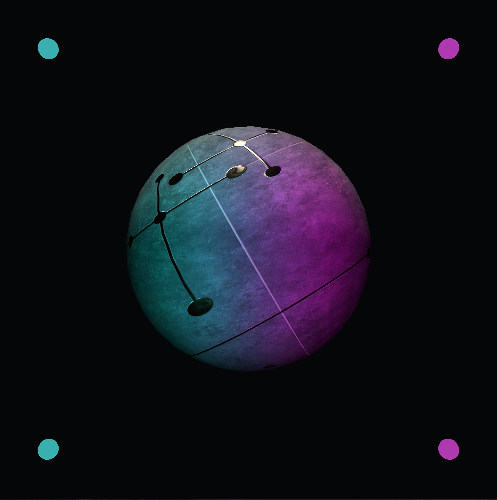

# Ice

Ice is a realtime c++ rendering engine being built because I learn by doing.  
I want to understand as many of the low level processes involved in getting an image rendered and presented to the screen as I possibly can.

The functional end goal of this project is to have a renderer that allows for realtime iteration during shader development. This includes the ability to change the rendering API (Vulkan, OpenGL, DirectX) and style of rendering (forward, deferred, pure & hybrid ray-tracing, etc.) on the fly.
> I am considering extending this desired feature-set to include offline rendering so I can experiment with higher cost rendering methodologies like path tracing, and to allow for higher resolution renders.

---

---

### Notable shaders
- Shadow mapping

### Rendering methodologies
- [x] Forward
- [ ] Deferred
- [ ] Hybrid RT (deferred)
- [ ] Pure RT

### Rendering APIs - Low priority
- [x] Vulkan
- [ ] OpenGL
- [ ] DirectX

---

---

## Roadmap
- UI
	- To manually edit shader parameters
	- Probably ImGui for now
- Post-processing
	- To better understand how to handle multiple renderpasses

#### Shaders
- PBR
- IBL

